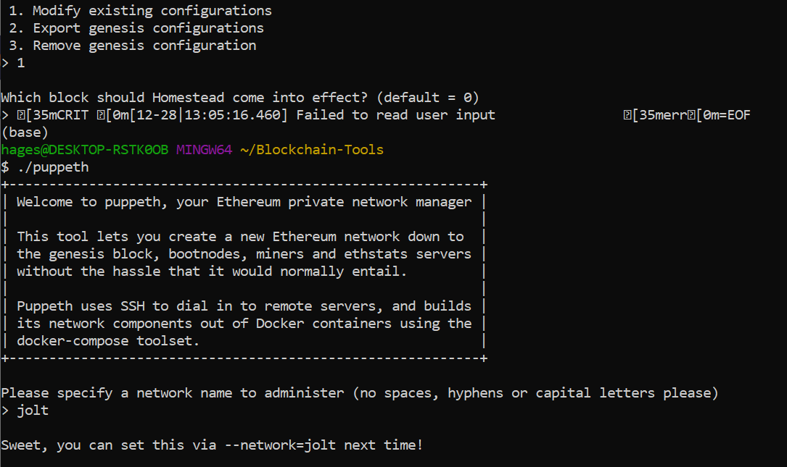

## Overview
Below you will find details of the blockchain created.  The configuration of the blockchain is outlined below, along with instructions on how to start the blockchain following creation.  Additionally, details are provided on how to test the blockchain, via sending transactions using MyCrypto.  Screenshots are provided to help visualize each process.  Additional screenshots can be found in the "Screenshots" folder for reference.  

### Network Configuration
The network is configured as follows: 
- Blocktime of 15 seconds, which is the default setting.  This represents the amount of time for a block to be included in the blockchain. 
- The network ChainID is 777. 
- An account password is set up on this network and will be needed to activate each node.  The password can be provided upon request. 
- Both nodes created are mining nodes, as can be identified in the geth commands outlined in the section below. 
- Node 1 and node 2 operate on separate ports (30303 and 30304, respectively). 
- A test network named "jolt" has been set up on MyCrypto to allow for testing of the network and sending transactions. 
- The screenshots below outline the steps of network configuration. 

### Starting the Blockchain 
The first step to allow access to launching the blockchain will be to ensure all Go Ethereum (geth) tools are installed.  Additionally, a MyCrypto wallet will need to be created.  Instructions to complete both tasks can be found here: [Install Guide](blockchain-install-guide.md)

Once all Go Ethereum dependencies are installed and a MyCrpto wallet is created, the blockchain can be launched via your terminal (GitBash on Windows).  The exact instructions outlined below are based on a Windows PC and utilizing GitBash.  Activation instructions may vary slightly depending on your operating system.  

- Launch a terminal window (GitBash) and navigate to your Blockchain-Tools folder (created in the above install instructions).  
- Unlock node1 (named jnode1 in this network) with the command below.  

  -  ./geth --datadir jnode1 --unlock "SEALER_ONE_ADDRESS" --mine --rpc --allow-insecure-unlock
  - IMPORTANT: When entering the sealer one address, be sure to leave the 0x pretense off the address when pasting it into your terminal (ex: 3a2dD48d933C50A3A5e9cd33A83D9C7C7F9Cc5ca).  Additional sealer one address info can be found below.  
  - This command accesses node 1 (named jnode1 in this network) with --datadir, plugs in the sealer address of that specific node, designates the node as a mining node (--mine command), and directs the system where to process and return results (--rpc command). 
  

- Unlock node2 (named jnode2 in this network) with the command below.
  -  ./geth --datadir jnode2 --unlock "SEALER_TWO_ADDRESS" --mine --port 30304 --bootnodes "enode://SEALER_ONE_ENODE_ADDRESS@127.0.0.1:30303" --ipcdisable --allow-insecure-unlock
    - IMPORTANT: When entering the sealer two address, be sure to leave the 0x pretense off the address when pasting it into your terminal (ex: 88CD2422014b12c608b1fDbFeB902c7f2734C477).  Additional sealer two address info can be found below. 
  - All commands operate in the same way as in node 1.  However, as noticed there are a few different / extra commands needed to unlock node 2.  The --port 30304 command simply directs this node to operate in a new port (30304 vs. 30303 for node 1).  This is because node 2 is mining separately in a separate terminal window.  The --bootnodes command directs node 2 to sync with node 1, which is why it is referencing the node 1 enode address.  Finally, the --ipcdisable is used to disable the IPC-RPC server on Windows.  This is again due to node 2 operating in a separate terminal window to node 1, which enabled RPC (--rpc command). 

  - The SEALER_ONE_ADDRESS, SEALER_TWO_ADDRESS, and SEALER_ONE_ENODE_ADDRESS were provided when creating and initializing each node.  A best practice is to document these addresses for ease of blockchain unlocking.  This data can be viewed in the screen shots provided in the "Screenshots" folder, as well as in the document attached.  
- Once the above steps are complete the blockchain will be up and running again.  

### The Network Running

The screen shots below provide an example of what the network looks like once it is activated and running.  The first screen shot is an example of node 1 in operation, and the second screen shot is an example of node 2 in operation. 

### Testing the Blockchain - MyCrypto
To ensure the blockchain is operating as designed, it can be tested using MyCrypto.  The steps outlined below explain how to connect to a custom network on MyCrypto and test the network by sending transactions.  

- Open MyCrypto and click on "Change Network" in the bottom left corner. 

- Click "Add Custom Node". 

- Make sure to select "Custom" for the network.  This will generate additional fields to be filled in.  

- Enter the Node Name, the Network(should already be set to "Custom" from the step above), the Network Name, Currency, ChainID, and URL. 
- The Currency should be set to ETH, and the ChainID will be the chain id generated when creating the genesis block. 
- The URL will be: http://127.0.0.1:8545. 
- Click "Save & Use Custom Node".

- You can verify you are connected to your newly created network by checking the network connection. 

Now that we are connected to the network created above, we can begin testing it by generating transactions between accounts.  Follow the steps outlined below to complete this. 

- Make sure you are on the "View & Send" tab in MyCrypto. 

- From there, click on "Keystore File".  This will bring up a new window, allowing you to unlock your keystore file. 

- Click on "Select Wallet File".  From there navigate to the directory where the node data was saved.  Access the node1 folder and then the keystore folder.  Click on the file within the keystore folder and click open.  

- The password created during the node generation will need to be entered to unlock the the file.  Once this is done, click "Unlock". 

Now that the account is unlocked, we are ready to send a transaction.  To do this, follow the steps below. 

- Enter the account address for node2 in the "To Address" box.  

- Enter an amount to be sent to that account and click "Send Transaction"

- A green confirmation message should populate below.  Within that box click on the "Check TX Status" button.  

- The transaction may still show in "Pending" status, but once "Check TX Status" is clicked again it should change to "Successful" status. 

- To view this transaction at a later time, you can also click on the "TX Status" button on the left hand side of the MyCrypto app.  From there you can enter the transaction hash (TX Hash), click "Check TX Status" and view the status once again.  

